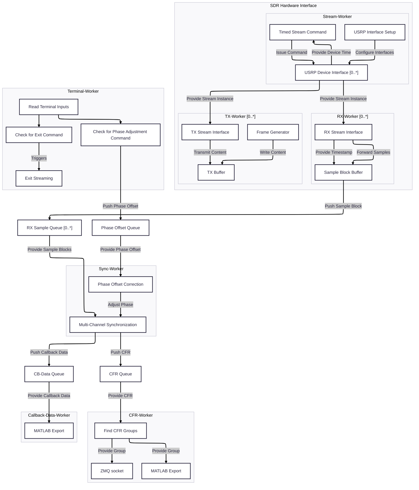

# doa4rfc
#### Realtime Direction-of-Arrival Estimation for RF Communication Protocols

## Objective  
This project aims to provide a flexible software architecture, to implement and test DoA methods for various RF communication protocols.

## Main Features
-  [MultiSync](include/multisync/README.md) for simultaneous processing and phase offset correction with multiple generic frame synchronizers based on [Liquid-DSP](https://liquidsdr.org)
- [multi_rx.h](include/multi_rx/multi_rx.h) for synchronized processing of multiple USRP RX streams in separated threads
- [ZMQ TCP interface](include/zmq_socket/README.md) for forwarding of CFRs to the python app running the DoA algorithm 
- [MATLAB export](include/matlab_export/matlab_export.h) to generate .m files for plotting CFR and constellation diagrams (check [matlabXport](https://github.com/F-L-X-S/matlabXport))
- [MUSIC Algorithm](music/music-spectrum.py) (multiple signal classification) python app based on [pyespargos](https://github.com/ESPARGOS/pyespargos) 
- [Main Application](src/main.cc) to estimate the DoA of an OFDM transmitter using USRPs connected via UHD

## Simulations
 [Simulations](simulations/) provided in ./simulations demonstrate the usage of the provided modules, illustrate the underlying mathematical concepts and show the simulation results:
- [Single-Channel CFR-Estimation](simulations/sim_singlechannel/README.md) 
- [Multi-Channel CFR-Estimation](simulations/sim_multichannel/README.md)
 
## Measurements
[Measurements](measurements/) show the real-world DoA results of the [Application](src/main.cc) using two USRP N210 with WBX daughterboard and provide the corresponding datasets.

## DoA estimation with USRP N210
 The [Main Application](src/main.cc) gives you a functioning example on how to employ the provided modules for DoA estimation with USRP N210. 

### Main App Process Flow



### Hardware Setup 
The software is tested using two USRP N210 with the WBXv3 daughterboard. Phase synchronization is achieved with the MIMO-cable. The USRPs are connected to the host by separate ethernet interfaces. For utilizing a different type of SDRs, the interfaces can be implemented in separated threads similar to `multi_rx.h`.  <br>
One USRP is used for transmitting and receiving the OFDM packages while the other USRP is used in RX-mode only. The MUSIC-spectrum visualizes the position of the TX-antenna. 
 <br>
Make sure, the receiving antennas are spaced by the half wavelength of the carrier frequency (e.g. 12cm for a carrier of 1.25GHz).

### Installation 
1. Clone the Repo to your local machine
2. Setup a virtual environment within the `./music/`directory <br>
   ```
   cd ./music
   python -m venv env
   ```
3. Install all python dependencies specified in `requirements.txt` <br>
   ```
    source env/bin/activate
    pip install -e . 
   ``` 
4. Use the CMake extension to configure the project 
5. Set `doa4rfc` as target for build and execution (or any example-file)
6. Go to the vscode "run and debug" menu and start the `Debug (Clang CMake Preset)` task to build and run the specified target 
<br><br>

Make sure, that all USRPs are connected via separate Ethernet interfaces, since the datarate can possibly cause overflows in the shared-Etehrnet mode. Check the USRP connection by running `uhd_find_devices`. 

### Main Dependencies
- [ZMQ](https://zeromq.org/languages/cplusplus/) for socket communication with the Python-implemented DoA Algorithm 
- [Liquid-DSP](https://liquidsdr.org) for frame-detection, generation and synchronization
- [UHD](https://files.ettus.com/manual/index.html) for USRP communication
